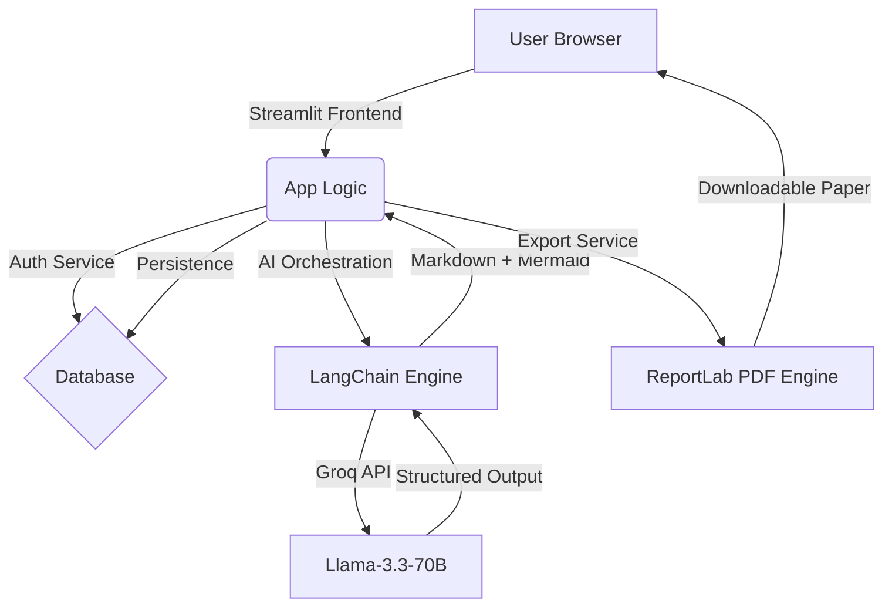

# 🔬 Aristotle AI: Universal Research Paper Platform

[](https://www.python.org/downloads/)
[](https://share.streamlit.io/)
[](https://groq.com/)
[](https://opensource.org/licenses/MIT)

**Aristotle AI** is a professional-grade, domain-agnostic research paper generation engine. It combines advanced Large Language Models (LLMs) with architectural visualization tools to produce high-fidelity academic content, complete with mathematical LaTeX equations and Mermaid.js diagrams.

---

## 🏗️ Project Architecture & System Design

The system follows a modular **Clean Architecture** pattern, separating the UI layer from the AI orchestration and data persistence layers.

### 🧩 System Flow Diagram



### 📁 Project Structure

- **`app.py`**: Entry point and hero landing page.
- **`auth/`**: Custom authentication logic using `bcrypt` for secure access.
- **`database/`**: SQLAlchemy ORM models and SQLite persistent storage.
- **`chains/`**: AI pipeline orchestration using LangChain.
- **`prompts/`**: Elite academic prompt engineering for high-fidelity output.
- **`exports/`**: PDF generation engine with support for complex academic formatting.
- **`utils/`**: Custom CSS, helper functions, and rich markdown rendering (Mermaid.js).
- **`pages/`**: Modular sub-systems (Dashboard, Paper Generation, Repository).

---

## 🌟 Key Features

- **Domain Agnostic**: Generate papers for IEEE (Engineering), MIT (Science), IIT (Technology), or Oxford (Humanities).
- **Visual Intelligence**: Automatically generates and renders architecture diagrams using **Mermaid.js**.
- **Elite Academic Depth**: Produces mathematical derivations, numerical examples, and professional abstracts.
- **Multi-Modal Support**: Guided generation via image and audio context uploads.
- **Production Hardened**: Pre-configured for deployment with hidden Streamlit toolbars and secure DB handling.

---

## 🛠️ Technical Stack

- **Framework**: [Streamlit](https://streamlit.io/) (Customized Premium UI)
- **AI Core**: [Groq](https://groq.com/) & [LangChain](https://www.langchain.com/)
- **ORM**: [SQLAlchemy](https://www.sqlalchemy.org/)
- **Database**: [SQLite](https://sqlite.org/)
- **Visuals**: [Mermaid.js](https://mermaid.js.org/)
- **PDF Export**: [ReportLab](https://www.reportlab.com/)

---

## 🚀 Installation & Setup

### 1. Clone the Repository
```bash
git clone https://github.com/yourusername/aristotle-ai.git
cd aristotle-ai
```

### 2. Configure Environment
Create a `.env` file in the root directory:
```env
GROQ_API_KEY=your_groq_api_key_here
```

### 3. Install Dependencies
```bash
pip install -r requirements.txt
```

### 4. Run the Application
```bash
streamlit run app.py
```

---

## 👨‍💻 Developer Information

**Bittu Sharma**  
*AI & MLOps Specialist*

- 🌐 [Portfolio](https://bittullmops.vercel.app/)
- 💼 [LinkedIn](https://www.linkedin.com/in/bittu-kumar-54ab13254/)
- 🐙 [GitHub](https://github.com/bittush8789)

---

## 📜 License

Distributed under the MIT License. See `LICENSE` for more information.

*“Unlocking the future of academic research through Intelligent Automation.”*
